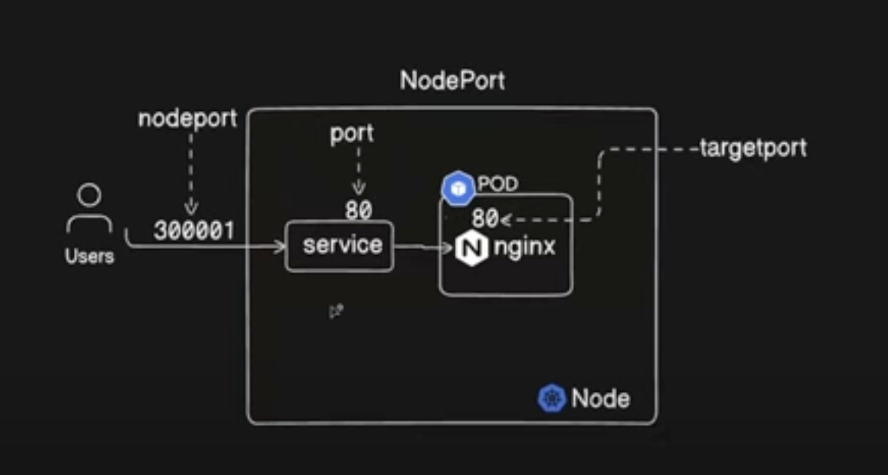

# kind cluster

## Installation

```bash
brew install kind 
```

## Creating cluster with configuration
```bash
 kind create cluster --name cluster2 --config config.yaml
 ```

 ## Switch conext to another cluster
```bash
 kubectl config use-context kind-kind-cluster1
 ```

# Pods

## Create Pod

### Create imperative way  
```bash
kubectl run pod ngix-pod --image=nginx:latest --port 80
```

### Verify version to check versions
```bash
kubectl explain pod
```

### create pod in declarative 
```bash
kubectl create -f simple-pod.yaml
```

### edit pod
```bash
kubectl edit pod nginx-pod
```

### describe pod to check images
```bash
kubectl describe pod nginx-pod
```

### Open pod in interactive mode
```bash
kubectl exec -it nginx-pod -- sh
```

### Write imperative comand and write into file

```bash
kubectl run nginx-pod2 --image=nginx --dry-run=client -o yaml  > simple-pod2.yaml
```

### more information of all pds

```bash
kubectl get pods -o wide
```

# Replication controller

### get RC
```bash
kubectl get rc
```

### Edit RS
```bash
kubectl edit rs/nginx-rs
```

### Increase Replicaset imperative way
```bash
kubectl scale --replicas=10 rs/nginx-rs
```

# Deployment

### change image version of all deployment
```bash
kubectl set image deploy/nginx-deploy \
nginx-pod=1.28.0
```

### Dry run to create deployment
```bash
 kubectl create deploy deploy/ngnix-deploy-new --image=nginx --dry-run=client -o yaml > dp-new.yaml
 ```

 # Services

In Kubernetes, a Service is a method for exposing a network application that is running as one or more Pods in your cluster.

## Types of Service
Cluster IP
NodePort
ExternalName
LoadBalancer


## Understand services via digram


# Namespace
kubectl get all -n=default

```bash
kubectl create ns demo
```


## Create deployment
```bash
kubectl create deploy nginx-demo --image=nginx -n demo
```

## Open pod in namespace
```bash
 kubectl exec -it nginx-demo-87cd4cbb7-r45vt -n demo -- sh
 ```

 ## Scale pods in deployment
 ```bash
 kubectl scale --replicas=3 deploy/nginx-demo -n demo
 ```
## Creating Service in other namespace
 ```bash
 kubectl expose deploy/nginx-demo --name=svc-demo --port=81 -n=demo
 ```

## check logs
```bash
kubectl logs pod/nginx-pod
```

Pod, deployments, replicasets, namespace, K8s architecture and its components, stateful sets, taint and toleration, service account, RBAC, services,

### get objects from all namespaces 
```bash
kubectl get ds -A
```

### Taints

```bash
kubectl taint node cluster3-worker2 gpa=true:NoSchedule
```
```bash
kubectl taint nodes node1 key1=value1:NoSchedule
kubectl taint nodes node1 key1=value1:NoExecute
kubectl taint nodes node1 key2=value2:NoSchedule
```